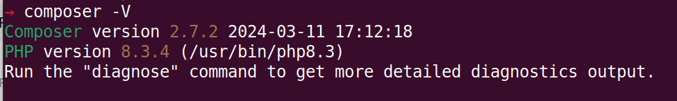

## La instalación 
Como ya hemos comentado Laravel, uno de los frameworks de PHP más populares, simplifica el desarrollo web mediante una estructura organizada y herramientas potentes.    
Para comenzar un proyecto en Laravel, existen dos enfoques principales:

* crear un proyecto con composer
* Instalar un programa llamado laravel con el que crearemos proyectos.
## Instalar composer
Lo primero que necesitamos es tener composer instalado en nuestro sistema

Composer es un sistema de gestión de dependencias para PHP que permite  especificar y manejar las librerías de las cuales sus proyectos dependen, a través de un fichero llamado composer.json.     
Igualmente, composer permite aportar documentación sobre el proyecto y automatizar la autocarga de clases para la ejecución del mismo.    
Funciona **descargando e instalando estas librerías y sus dependencias en el proyecto, asegurando compatibilidad y facilitando la actualización**.    
Es esencial para proyectos modernos de PHP, ya que automatiza y gestiona tareas complejas de gestión de paquetes de forma eficiente.

Para instalar composer
* Linux- Mac: https://getcomposer.org/doc/00-intro.md#installation-linux-unix-macos
* Windows https://getcomposer.org/doc/00-intro.md#installation-windows
  
* 
  composer -V
  
  Entonces veremos una salida, si simplemente escribmos composer saldrán todas las opciones disponibles
  Una vez instalado en un terminal (CMD o PowerShell en windows) escribimos
  

## Instalar el instalardor Laravel
{}
#### Laravel installer

****
Laravel no es ni un EDI, ni un lenguaje de programación, es un framework.    

Necesitamos de alugna manera un programa que nos permita crear un proyecto nuevo con la estructura y todas las utilidades que ofrece el framework
Podemos instalar un instalador de laravel  con composer:
Instalador de Laravel:  
   Alternativamente, puedes utilizar el instalador de Laravel, una herramienta ligera que se instala globalmente en tu sistema a través del comando
   
   composer global require laravel/installer
   .

{}
### Creando un proyecto

>* Uso de Composer:    
   Puedes crear un nuevo proyecto Laravel ejecutando el comando
   
   composer create-project laravel/laravel nombre_proyecto
        
   Este método instala Laravel y todas sus dependencias, configurando una estructura de directorios lista para comenzar a desarrollar tu aplicación.

   Este instalador permite crear nuevos proyectos rápidamente con el comando laravel new nombre_proyecto.
   Además utilizando esta herramiena, el comando laravel durante el proceso de instalación, se irán planteando opciones durante que puedes elegir

Este programa es un instalador de proyectos de laravel que es una herramienta en línea de comandos que nos va a permitir crear un proyecto  base de laravel.   Para ello escribimos
laravel new nombre_proyecto
Puede ser que dé algún problema y no reconozca la orden laravel. en este caso deberíamos de actualizar el path del sistema incluyendo el directorio donde haya instalado laravel

