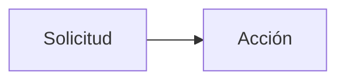

# Concetpo de rutas
####

****
Las rutas son la forma de definir cómo se deben manejar las solicitudes HTTP a tu aplicación.

Especifican qué acción se debe tomar cuando se accede a una URI específica, conectando URLs con el código que genera las respuestas a esas URLs.

Las podemos ver como las reglas que determinan cómo se responde a cada petición entrante a tu aplicación web.
## Directorio Routes   
La carpeta routes en un proyecto Laravel es crucial, ya que en los fichero que contiene, se van a  definir cómo tu aplicación responde a las solicitudes HTTP

Después de una instalación estándar, tedremos dos ficheros:   

    

>* web.php    
En él, se definen las rutas accesibles a través del navegador, gestionando solicitudes GET, POST, PUT, PATCH, DELETE, OPTIONS.
Tendremos otros métodos disponibles, según se verán.  
Aquí puedes agrupar rutas, asignarles middleware para control de acceso, y vincularlas a controladores que manejan la lógica de la aplicación.
>* console.php   
Este archivo es donde defines todas las rutas CLI (Command Line Interface) o comandos de Artisan (comando que ejecutaremos desde el terminal para interactuar con nuestra aplicación
>
### Contenido
En el fichero de rutas usaremos simpre la facade Route
Es una Interfaz estática que va a permitir invocar  a los diferentes métodos para que nuestra aplicación ofrezca recursos web.
La idea es establecer ante una solicitud establecer una acción :

En la imagen siguiente especificamos con más detelle el contenido

[//]: # ()

[//]: # ()
[//]: # ()
### La solicitud
### La acción 

***

 
## Rutas
## Artisan

