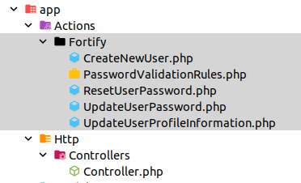

# Instalando fortify
* Referencia en la web https://laravel.com/docs/master/fortify

* Instalación

  composer require laravel/fortify # Instalar el paquete
  php artisan fortify:install # publicar los recursos de fortify
  php artisan migrate # ejecutar las migraciones
* 
**Qué se ha instalado y cómo usarlo
Observamos que no se ha 
**Http/Controller**:
    
Por otro lado, respecto a las migracines aparece una migración que modifica la tabla **users**, añadiendo los siguientes campos para la autenticaciń 2FA:

* 
## Personalizando

### Enlazando el front

### Actuando en el registro

### Actuando en el logout

### Redirigir (next login or logout)

### Personalizando perfiles

### Los teams

### Subiendo imágenes
