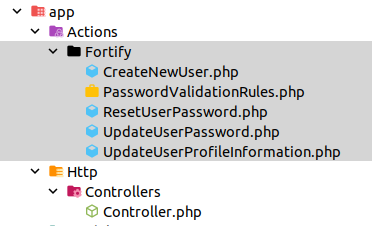

# Introducción y concepto del paquete
* Referencia en la web https://laravel.com/docs/master/fortify
> Fortify es un paquete que podemos instalar en nuestras aplicaciones de laravel para gestionar la autenticación.

{}
#### 
****
  
A la hora de instalar, podemos instalar primero fortify, y luego Jetstream, pero es aconsejado la instalación de Jetstream que ya incorpora fortify

Este paquete o librería se centra en la parte del **back**, dejando al desarrollador libertad a la hora de implementar la parte del front (vistas) que no instala por defecto.
Entre sus funcionalidades:
* Registro de usuarios.
* Inicio de sesión.
* Restablecimiento de contraseñas.
* Verificación de correo electrónico.
* **Verificación de dos factores (2FA)** *(No en breeze)*.
Además podemos conseguir de forma sencilla gestionar estas acciones que no vienen configuradas por defecto
* **Administración de sesiones** *(No en breeze)*.
* **Bloqueo de usuarios** *(No en breeze)*.
{}

Si lo instalamos con jetStream, añadimos las siguientes funcionalidades:
## Su funcionamiento
* Instalación

  composer require laravel/fortify # Instalar el paquete
  php artisan fortify:install # publicar los recursos de fortify
  php artisan migrate # ejecutar las migraciones
* 
Una vez instalado el paquete tenemos los siguientes controladores disponibles,no ha instalado ningún controlador en **Http/Controller**:
    
Por otro lado, respecto a las migracines aparece una migración que modifica la tabla **users**, añadiendo los siguientes campos para la autenticaciń 2FA:

* 
## Personalizando

### Enlazando el front

### Actuando en el registro

### Actuando en el logout

### Redirigir (next login or logout)

### Personalizando perfiles

### Los teams

### Subiendo imágenes
