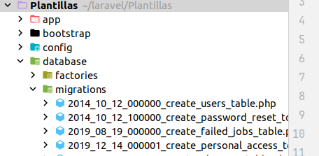

{}
#### Qué son las migraciones 
****
Una migración en Laravel, es una clase que nos permite crear y modificar la estructura de la base de datos  de manera controlada y organizada,
Nos va a permitir agregar, modificar y/o eliminar tablas y columnas , según sea necesario a lo largo del tiempo de vida de nuestra aplicación.
Una migración nos va a permitir establecer la composicion y estructura de nuestra base de datos DDL
{}

{}
#### Ubicacion de las migraciones 
****

{}
