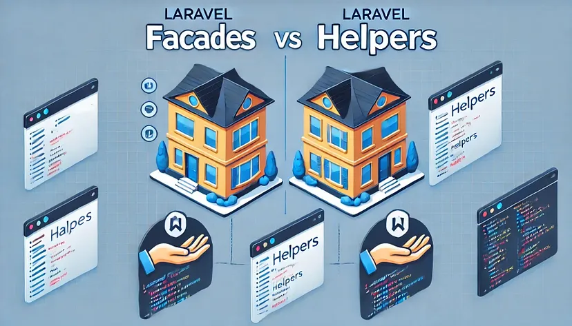

# Helpers en Laravel

## ¿Qué son los Helpers?

Helpers en Laravel son funciones globales que proporcionan una manera conveniente y eficiente para realizar tareas comunes en la programación con Laravel. Estas funciones están disponibles globalmente en cualquier parte de tu aplicación.

## Grupos Principales de Helpers

### Helpers de Rutas
- `route()`: Genera una URL para una ruta nombrada.
- `url()`: Genera una URL absoluta.
- `action()`: Genera una URL para un controlador y método específicos.

### Helpers de Strings
- `str_*`: Varias funciones para manipular strings.
- `__()`: Traduce el texto dado según tu localización.

### Helpers de Arrays
- `array_*`: Funciones para manipular arrays.
- `head()`: Devuelve el primer elemento de un array.
- `last()`: Devuelve el último elemento de un array.

### Helpers de Vistas
- `view()`: Genera una nueva vista.
- `response()`: Crea una instancia de respuesta.

### Helpers de URL
- `asset()`: Genera una URL para un asset usando el esquema de URL actual.
- `secure_asset()`: Genera una URL segura para un asset.

### Helpers Generales
- `app()`: Accede a la instancia del contenedor de servicios.
- `config()`: Obtiene o establece valores de configuración.
## Facade Vs Helper
https://medium.com/@azimidev/laravel-facades-vs-helpers-understanding-the-differences-and-use-cases-007d41a1b257

Laravel Facades vs. Helpers: Understanding the Differences and Use Cases

When developing with Laravel, you’ll often come across two powerful tools: Facades and Helpers. Both are designed to simplify your code and make it more readable, but they serve different purposes and are used in different scenarios. In this article, we’ll explore what Laravel Facades and Helpers are, their differences, and when to use each.

What are Laravel Facades?
Facades provide a “static” interface to classes that are available in the application’s service container. They allow you to call methods in a class without having to instantiate them, making your code cleaner and more concise.

Example: Using Facades

use Illuminate\Support\Facades\Cache;

Cache::put('key', 'value', $minutes);
$value = Cache::get('key');


Here, Cache is a facade that provides access to the caching service in Laravel.


$value = array_get($array, 'key', 'default');
$slug = str_slug('Laravel Facades vs Helpers');
$url = route('home');


Helpers are designed to be straightforward to use, offering quick solutions for common tasks.

Key Differences
Implementation:

Facades: Act as static proxies to underlying classes in the service container.
Helpers: Simple, procedural functions.
Dependency Injection:

Facades: Work with Laravel’s service container, making it easier to manage dependencies and mock services in tests.
Helpers: Do not support dependency injection, which can make testing more challenging.
Readability and Intent:

Facades: This can make code more readable by clearly indicating, which service is being used.
Helpers: Provide a quick and dirty way to perform tasks, which can sometimes lead to less readable code.
When to Use Facades
Dependency Injection: When you need to leverage dependency injection, especially in testing.
Readability: When you want to make it clear which service is being utilized.
Complex Logic: For more complex interactions with Laravel services.
Example: Using a Facade in a Controller


use Illuminate\Support\Facades\Mail;

public function sendWelcomeEmail($user)
{
Mail::to($user->email)->send(new WelcomeEmail($user));
}


When to Use Helpers
Simplicity: For simple tasks where dependency injection is not necessary.
Quick Solutions: When you need a quick and straightforward solution.
Performance: When you want to avoid the overhead of the service container.
Example: Using Helpers in a Blade Template



{{ ucfirst($user->name) }}

{{ route('profile', ['id' => $user->id]) }}


Conclusion
Both Facades and Helpers have their place in Laravel development. Understanding when to use each can help you write cleaner, more maintainable code. Use Facades when you need the power of the service container and dependency injection. Use Helpers for quick, simple tasks. By leveraging both appropriately, you can make the most out of Laravel’s features and improve your development workflow.