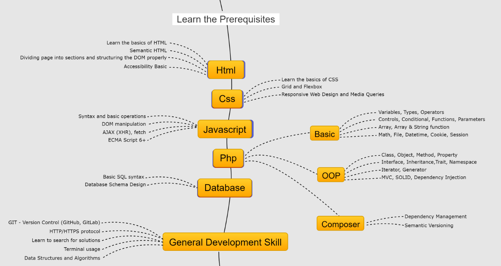

## Roadmap
Un Roadmap es cómo vamos a enfocar el aprendizaje de esta nueva forma de desarrollar una aplicación web
Vamos a estudiar un framework de php.
### Conocimientos previos
{}
### Punto de partida
****
Para aprenderlo tomamos este punto de partida:

{}
### Aspectos a estudiar
{}
Vamos a realizar un proceso no secuencial, pero iremos viendo, analizando y practicando con estos aspectos

Los aspectos que vamos a tratar los podemos representar en la sigueinte imagen:

Roadmap Laravel



{}
### Referencias

{}
#### 
****
### Referencias en la web 
***
1. Laravel Documentation

 Documentación oficial de Laravel. Laravel Documentation (https://laravel.com/)    

2. Laracasts 

Videos tutoriales sobre  Laravel y tecnologías web. Laracasts (https://laracasts.com/)    
3. Laravel News: Noticias, tutoriales y paquetes relacionados con Laravel. Laravel News https://laravel-news.com/

4. Laravel Daily https://laraveldaily.com/
 Es un sitio dedicado a tutoriales y recursos para desarrolladores de Laravel, ofreciendo desde consejos rápidos hasta cursos y tutoriales premium. Contiene una variedad de contenidos que cubren aspectos básicos hasta avanzados de Laravel, como Eloquent ORM y nuevas funcionalidades en Laravel 11. Además, provee ejemplos de código, ofertas de trabajo, y herramientas premium, haciéndolo un recurso valioso tanto para aprendices como para desarrolladores experimentados en busca de mantenerse actualizados con Laravel.    

5. GitHub y Packagist Para buscar paquetes de Laravel y proyectos de código abierto. GitHub (https://github.com/search?q=laravel&type=repositories) Packagist


{}

```markmap
# Laravel
## Instalación
## MVC
## Blade
### Jerarquía de plantillas
### Componentes html
#### Laravel [Livewire](https://laravel-livewire.com/)
### Componentes JS
#### Inertia [Inertia](https://inertiajs.com/)
## Rutas
## Artisan
## Controladores
## Modelos
## RestFull
## Api
## Autenticacion
## Roles
```

